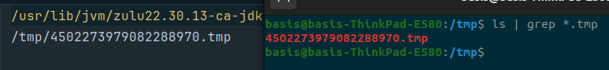

The following errors occurs on Ubuntu 22.04.4 LTS.  
When attempting to use the `download` method of the `Page` class the following error message is output:
```
com.webforj.exceptions.WebforjRuntimeException: Failed to download file.
at com.webforj.Page.download(Page.java:762)
at com.webforj.issues.DownloadWithPage.run(DownloadWithPage.java:10)
at com.webforj.App.initialize(App.java:68)
at com.webforj.utilities.WelcomeApp.launchClass(WelcomeApp.java:201)
at com.webforj.utilities.WelcomeApp.buildAppList(WelcomeApp.java:99)
at com.webforj.utilities.WelcomeApp.run(WelcomeApp.java:64)
at com.webforj.App.initialize(App.java:68)
at java.base/jdk.internal.reflect.DirectMethodHandleAccessor.invoke(DirectMethodHandleAccessor.java:103)
at java.base/java.lang.reflect.Method.invoke(Method.java:580)
at com.basis.startup.LoadLibrary.invokeMethodInContext(LoadLibrary.java:96)
at com.basis.util.common.security.SecurityClassLoader$InvocationHelperImpl.invokeMethod(SecurityClassLoader.java:211)
at com.basis.bbj.processor.program.type.JavaType$JavaMethod.invoke(JavaType.java:404)
at com.basis.bbj.processor.program.type.SignatureHandler.dispatch(SignatureHandler.java:142)
at com.basis.bbj.processor.program.type.JavaType$JavaSignature.dispatch(JavaType.java:312)
at com.basis.bbj.processor.program.type.SignatureHandler.handleSignature(SignatureHandler.java:106)
at com.basis.bbj.processor.instruction.abstractinstruction.AbstractMethod.invokeSignature(AbstractMethod.java:357)
at com.basis.bbj.processor.instruction.abstractinstruction.AbstractMethod.invokeSignature(AbstractMethod.java:87)
at com.basis.bbj.processor.instruction.JavaObjMethod.execute(JavaObjMethod.java:104)
at com.basis.bbj.processor.instruction.privileged.InterpreterBase.executeFrame2(InterpreterBase.java:3510)
at com.basis.bbj.processor.instruction.privileged.InterpreterBase.executeFrame(InterpreterBase.java:3224)
at com.basis.bbj.processor.instruction.privileged.InterpreterBase.run(InterpreterBase.java:637)
at com.basis.util.common.BasisThread.run(BasisThread.java:76)
Caused by: com.basis.startup.type.BBjException: [/tmp/1443524274918082388.tmp] User not allowed: User nobody does not have permission to open /tmp/1443524274918082388.tmp
at com.basis.bbj.util.ServerGlobals.toBBjException(ServerGlobals.java:149)
at com.basis.bbj.channel.BBjChannelFinder.open(BBjChannelFinder.java:706)
at com.basis.bbj.processor.ChannelMgr.getInternalChannel(ChannelMgr.java:1905)
at com.basis.bbj.proxyimpl.BBjClientFileSystemImplWeb.copyToClient(BBjClientFileSystemImplWeb.java:314)
at com.basis.bbj.proxyimpl.BBjClientFileImplWeb.copyToClient(BBjClientFileImplWeb.java:200)
at java.base/jdk.internal.reflect.DirectMethodHandleAccessor.invoke(DirectMethodHandleAccessor.java:103)
at java.base/java.lang.reflect.Method.invoke(Method.java:580)
at com.basis.util.common.BaseInvocationHandler$1.run(BaseInvocationHandler.java:163)
at java.base/java.security.AccessController.doPrivileged(AccessController.java:571)
at com.basis.util.common.BaseInvocationHandler.invoke(BaseInvocationHandler.java:170)
at jdk.proxy2/jdk.proxy2.$Proxy252.copyToClient(Unknown Source)
at com.webforj.Page.performDownload(Page.java:817)
at com.webforj.Page.download(Page.java:760)
... 21 more
Caused by: com.basis.filesystem.FilesystemException: [/tmp/1443524274918082388.tmp] User not allowed: User nobody does not have permission to open /tmp/1443524274918082388.tmp
at com.basis.server.local.util.AccessFiles.ioExceptionToFSException(AccessFiles.java:446)
at com.basis.server.local.util.AccessFiles.openOrNull(AccessFiles.java:183)
at com.basis.server.local.util.AccessFiles.open(AccessFiles.java:139)
at com.basis.server.local.LocalServerConnection.open(LocalServerConnection.java:2126)
at com.basis.server.local.LocalServerConnection.open(LocalServerConnection.java:1846)
at com.basis.server.local.LocalServerConnection.open(LocalServerConnection.java:1082)
at com.basis.server.local.LocalServerConnection.open(LocalServerConnection.java:100)
at com.basis.filesystem.remote.ConnectionMgrImpl.openDirect(ConnectionMgrImpl.java:2040)
at com.basis.filesystem.remote.ConnectionMgrImpl.open(ConnectionMgrImpl.java:1866)
at com.basis.filesystem.remote.ForwardingConnectionMgr.open(ForwardingConnectionMgr.java:509)
at com.basis.filesystem.ConnectionMgr.open(ConnectionMgr.java:1542)
at com.basis.filesystem.ConnectionMgr.open(ConnectionMgr.java:1144)
at com.basis.bbj.comm.RuntimeFilesystem.open(RuntimeFilesystem.java:423)
at com.basis.bbj.channel.BBjFile.open(BBjFile.java:248)
at com.basis.bbj.channel.BBjChannelFinder.openFile(BBjChannelFinder.java:1789)
at com.basis.bbj.channel.BBjChannelFinder.openFile(BBjChannelFinder.java:1749)
at com.basis.bbj.channel.BBjChannelFinder.scanUnixDft(BBjChannelFinder.java:2045)
at com.basis.bbj.channel.BBjChannelFinder.scanPaths(BBjChannelFinder.java:2646)
at com.basis.bbj.channel.BBjChannelFinder.open(BBjChannelFinder.java:665)
... 32 more
Caused by: com.basis.server.bbjnative.PermissionException: User nobody does not have permission to open /tmp/1443524274918082388.tmp
at com.basis.server.files.SafeBBjFileChannelContainer.internalNewBBjFileChannel(SafeBBjFileChannelContainer.java:1072)
at com.basis.server.files.SafeBBjFileChannelContainer$2.handle(SafeBBjFileChannelContainer.java:317)
at com.basis.server.files.SafeBBjFileChannelContainer.doCreateProtected(SafeBBjFileChannelContainer.java:1465)
at com.basis.server.files.SafeBBjFileChannelContainer.newBBjFileChannelOrNull(SafeBBjFileChannelContainer.java:307)
at com.basis.server.files.BBjFileChannels.newBBjFileChannelOrNull(BBjFileChannels.java:481)
at com.basis.server.local.util.AccessFiles.openOrNull(AccessFiles.java:162)
... 49 more
webapp.min.js line 1 > Function line 3 > eval:1:9
<anonym> http://localhost:8888/gwtwebclient/webapp/webapp.min.js line 1 > Function line 3 > eval:1
anonymous http://localhost:8888/gwtwebclient/webapp/webapp.min.js line 1 > Function:3
anonymous http://localhost:8888/gwtwebclient/webapp/webapp.min.js line 1 > Function:3
processServerMessage http://localhost:8888/gwtwebclient/webapp/webapp.min.js:1
dwc_running http://localhost:8888/gwtwebclient/webapp/webapp.min.js:1
dwc_running http://localhost:8888/gwtwebclient/webapp/webapp.min.js:1
```

`DownloadWithPage` can be used to recreate it.

Simulating the method with `DownloadDirectly` results in not Exception being thrown.


